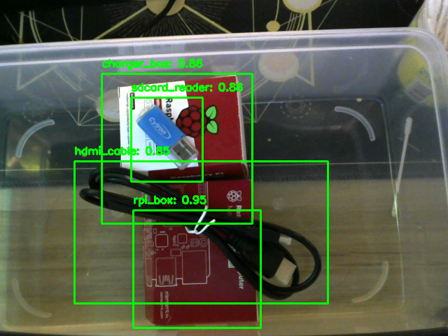
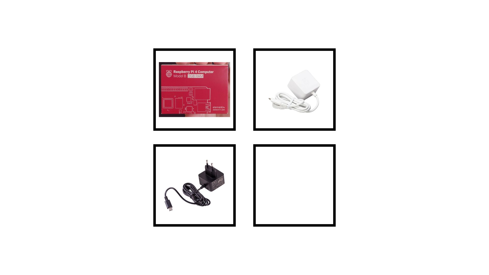

# YAS-LogisticS
## Problem Statement
The process of renting equipment, such as IoT technologies like Raspberry Pi, can be cumbersome and requires significant manual intervention. The current procedure for renting a Raspberry Pi at SiT involves the following steps:

1. A staff member brings the equipment into the lab room where students are present.
2. Staff members set up laptops with Excel spreadsheets to log student credentials and the loaned equipment.
3. Students queue up to manually input their credentials and the requested equipment into the spreadsheet.
4. Staff members validate the input details and hand over the equipment.
5. Students later need to arrange a meeting with the staff member to return the loaned equipment.

### Issues with the Current Process
#### Human Error
- Students may input their credentials incorrectly.
- Staff members may incorrectly validate the input or hand over the wrong equipment.

#### Technical Error
- The Excel spreadsheet may become corrupted or lost due to technical issues, leading to a loss of tracking for loaned equipment.

#### Malicious Intent
- Students may purposely delete rows from the Excel spreadsheet or input fake credentials while a staff member is distracted.
- Students may return a defective or inferior clone of the equipment.

## Proposed Solution
To address these issues, we propose the development of an **automated equipment rental system**. This system will utilize modern technologies to streamline the rental process, reduce human error, and enhance security.

### Key Features
#### Automated Check-In/Check-Out
- Implement an on-site web-based application where students can log in using their student card (RFID) to request and return equipment.

#### Equipment Condition Verification
- Students loaning equipment will be required to take pictures of the loaned equipment before and after rental.
- Utilize machine learning to identify equipment and verify that its condition remains the same before and after loaning.

#### Real-Time Tracking
- Integrate a database to track the status of each piece of equipment in real-time, ensuring accurate inventory management.
- Provide staff with a dashboard to monitor equipment availability and rental history.

#### Error Reduction
- Automate the validation process to minimize human error in credential input and equipment allocation.
- Implement data validation checks to ensure the accuracy of student and equipment information.

---
## Basket System
### Item Detection Model (YOLO v8 + Roboflow)
#### Description
This model is trained using YOLOv8 with a dataset prepared in Roboflow. It is designed for real-time object detection, drawing bounding boxes around detected items and labeling them with confidence scores. ** STRICTLY RUN IN WINDOWS ONLY **

Model Details
- Model: Trained using YOLOv8 (best.pt)
```yolo train model=yolov8n.pt data=data.yaml epochs=100 imgsz=640```
- Training Platform: Dataset Prepared via Roboflow
``https://app.roboflow.com/login``
- Inference Framework: Ultralytics YOLO

---
### Item Detection Code (detection_overlaying_items.py)
#### Description
This script utilizes YOLOv8 for real-time object detection using a webcam feed. It continuously captures video frames from the webcam, processes them using a trained YOLOv8 model (best.pt), and overlays bounding boxes with confidence scores and labels around detected objects.

####How it works
1. **Load YOLOv8 Model**
   - The script loads a pre-trained YOLOv8 model from best.pt.
2. **Open Webcam**
   - The script accesses the first available webcam (cv2.VideoCapture(0)).
   - If the webcam is unavailable, an error message is displayed.
3. **Perform Real-Time Object Detection**
   - Each frame is passed through the YOLO model for inference.
   - Objects with confidence scores above 0.6 are considered valid detections.
4. **Overlay Bounding Boxes & Labels**
   - Bounding boxes are drawn around detected objects.
   - Labels (object class names) and confidence scores are displayed above each bounding box.
5. **Display the Detection Results**
   - The annotated video feed is displayed using OpenCV (cv2.imshow).
   - The script continues running until the user presses the 'q' key to exit.
6. **Cleanup**
   - Once the script stops, the webcam is released, and OpenCV windows are closed.

####Output

---
## Black Bordered Box System
### Item Detection Model (item_machine_learning.py)
#### Description
This code trains a **Convolutional Neural Network (CNN)** to detect different rental items, specifically `raspberrypi4` and `raspberrypi4charger`. The model is trained using TensorFlow and Keras on a dataset of categorized images. 

#### How It Works
1. **Data Preprocessing**
   - Loads training and validation images from directories.
   - Applies data augmentation (rotation, shifting, flipping) to improve generalization.
   - Rescales images to a normalized pixel range of `[0,1]`.

2. **Model Architecture**
   - Three convolutional layers extract important features.
   - Each layer is followed by max pooling to reduce dimensionality.
   - The extracted features are flattened and passed through a fully connected layer.
   - Dropout is used to prevent overfitting.
   - The final softmax layer outputs predictions for two classes (`raspberrypi4`, `raspberrypi4charger`).

3. **Training Process**
   - The model is compiled using Adam optimizer and categorical cross-entropy loss.
   - It is trained over `50 epochs` using the prepared training and validation datasets.
   - The trained model is saved as `item_detection_model.h5`.

#### Simple Flow
```
Load dataset -> Apply preprocessing -> Build CNN model -> Train model -> Save trained model
```

#### Item Detection Script (test_without_webcam.py)
#### Description
This script processes an image containing multiple boxes to detect whether an item is present in each box. If an item is detected, a trained machine learning model classifies the type of item. The processed image is then saved with detected boxes highlighted.

##### Simple Flow of Execution
```
1. Load the image.
2. Convert it to grayscale and apply thresholding to identify boxes.
3. Detect rectangular boxes based on contours.
4. Extract each box and determine if an item is inside.
5. If an item is detected, classify it using a trained deep learning model.
6. Save the processed image with annotations and return results.
```

#### Step-by-Step Breakdown
1. **Load the Image**
   - The script reads the input image using OpenCV (`cv2.imread`).
   - If the image cannot be loaded, it prints an error and exits.

2. **Preprocess the Image**
   - Converts the image to grayscale (`cv2.cvtColor`).
   - Applies thresholding to create a binary mask that highlights the boxes.
   - Finds contours to identify rectangular box regions.

3. **Detect and Extract Boxes**
   - Filters out small or irregular shapes, keeping only rectangular boxes.
   - Stores box coordinates and sorts them for consistency.

4. **Analyze Each Box**
   - Crops each box and converts it to grayscale.
   - Applies a threshold to detect non-white pixels, indicating the presence of an item.

5. **Classify the Item (if detected)**
   - Resizes the detected item image to match the input shape of the trained `item_detection_model.h5`.
   - Uses `img_to_array` to convert the image for model prediction.
   - Feeds it into the TensorFlow model to classify the item.
   - If confidence is below `68%`, labels it as "Unknown."

6. **Draw Boxes and Save Output**
   - Draws bounding boxes around detected items and labels them.
   - Saves the processed image with annotations.

7. **Output the Results**
   - Prints the details of detected boxes and items.
  
---

### Before and After Image Comparison
Below are sample images demonstrating the **Before and After** item detection process:

#### Before Detection


#### After Detection

